# dictacode Architecture Diagrams (Solarized Light)

Palette (Solarized Light):
- Background: `#fdf6e3` (base3), `#eee8d5` (base2)
- Text: `#073642` (base02), `#657b83` (base00)
- Accents: `#268bd2` (blue), `#2aa198` (cyan), `#859900` (green), `#b58900` (yellow), `#cb4b16` (orange), `#dc322f` (red), `#d33682` (magenta), `#6c71c4` (violet)

---

## 1. System Overview (STT ↔ HID with IPC/API/CP)

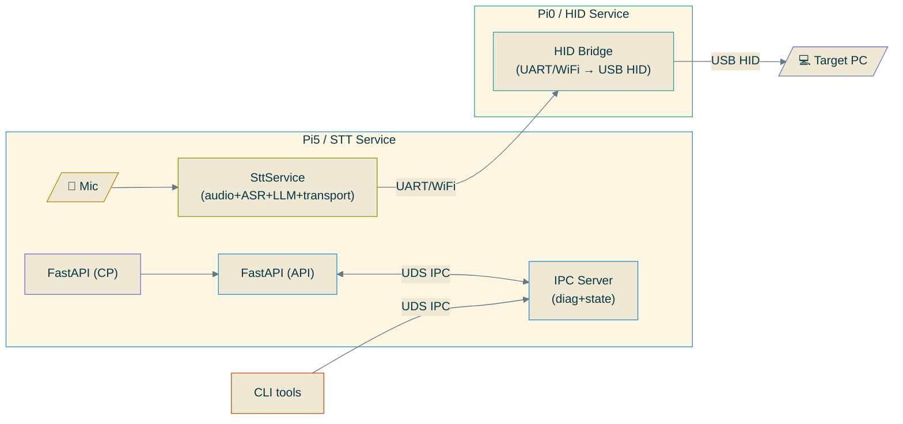

---

## 2. Audio/ASR/LLM Pipeline

```mermaid
%%{init: {'theme': 'base', 'themeVariables': { 'primaryColor': '#fdf6e3', 'primaryTextColor': '#073642', 'primaryBorderColor': '#268bd2', 'lineColor': '#657b83'}}}%%
flowchart LR
    MIC["Mic (ALSA)"]
    PORTS["AudioPortManager\n+ profiles"]
    BUF["RingBuffer\n16kHz mono"]
    RESAMPLE["Resampler"]
    ASR["ASR Adapter\nWhisper/Vosk"]
    LLM["LLM Postproc\n(optional)"]
    PROTO["Protocol\n(cmd/text messages)"]
    TX["Transport\nUART/WiFi/USB-serial"]

    MIC --> PORTS --> BUF --> RESAMPLE --> ASR --> LLM --> PROTO --> TX

    style MIC fill:#fdf6e3,stroke:#b58900,color:#073642
    style PORTS fill:#eee8d5,stroke:#268bd2,color:#073642
    style BUF fill:#eee8d5,stroke:#2aa198,color:#073642
    style RESAMPLE fill:#eee8d5,stroke:#2aa198,color:#073642
    style ASR fill:#eee8d5,stroke:#859900,color:#073642
    style LLM fill:#eee8d5,stroke:#6c71c4,color:#073642
    style PROTO fill:#eee8d5,stroke:#cb4b16,color:#073642
    style TX fill:#eee8d5,stroke:#2aa198,color:#073642
```

---

## 3. Components (Service + IPC + API/CP)

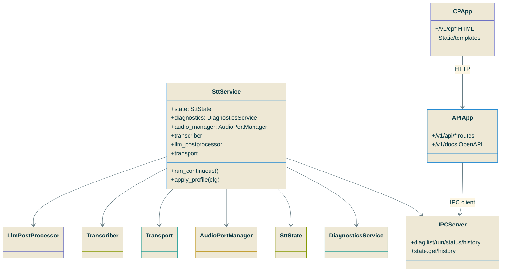

---

## 4. Observability Surfaces (Diagnostics + State)

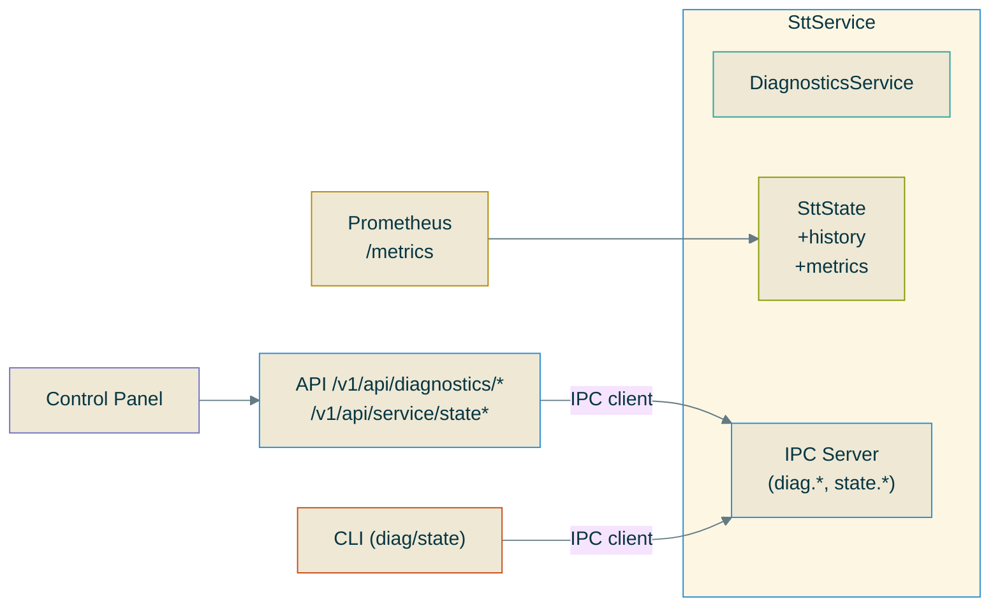

---

## 5. API vs Control Panel (Split Apps)

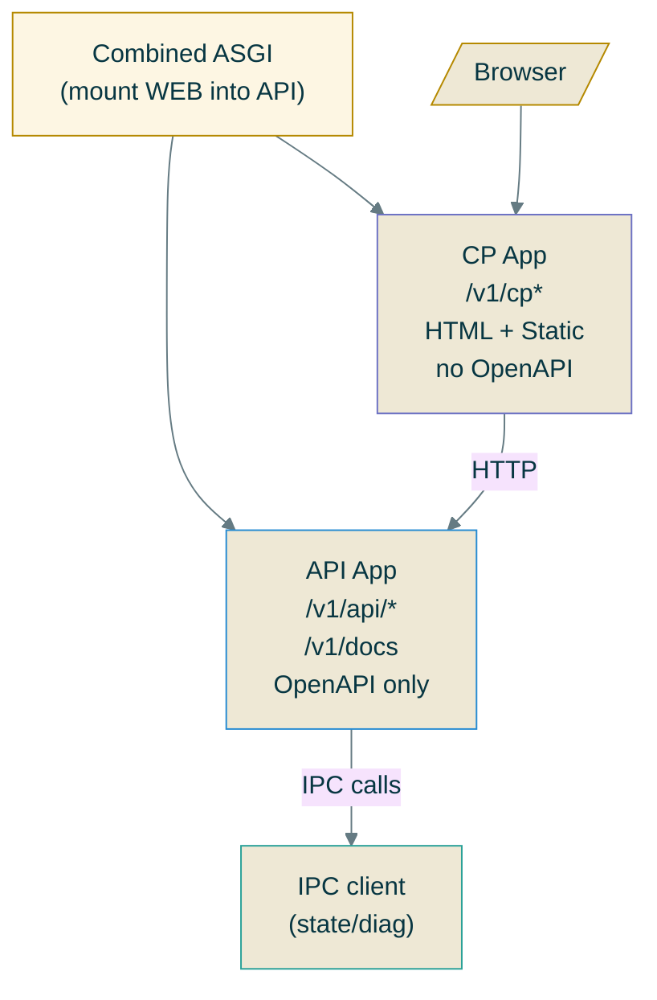

---

## 6. Config & Profiles

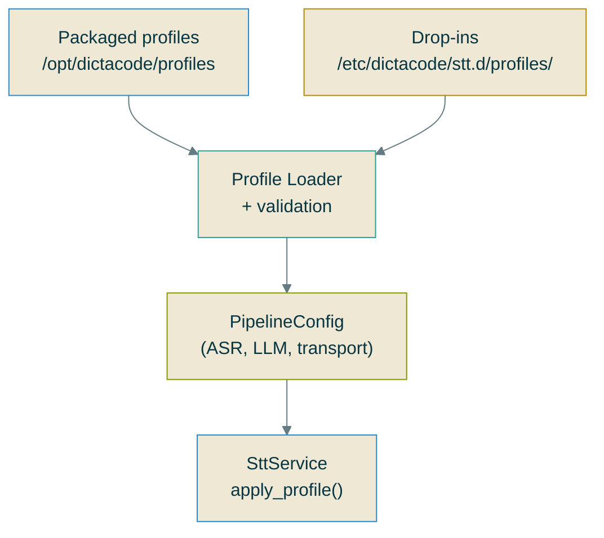

---

## 7. Diagnostics Flow (IPC)

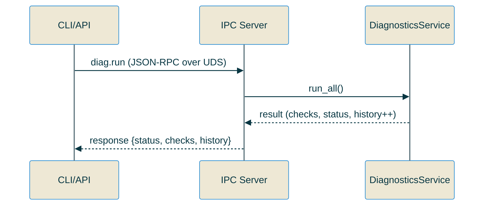

---

## 8. State Flow (Transitions + IPC)

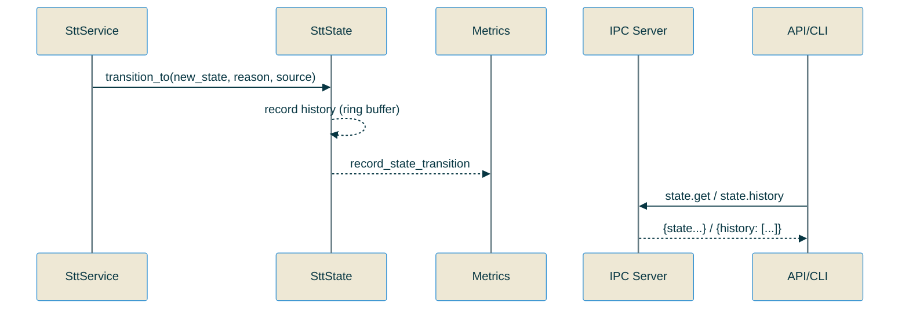

---

## 9. Deployment (Packages)

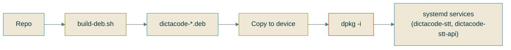

---

## 10. Directory Structure (Key Paths)

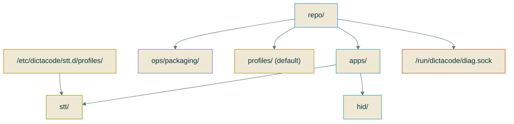

---

## 11. Boot Sequence (Systemd)

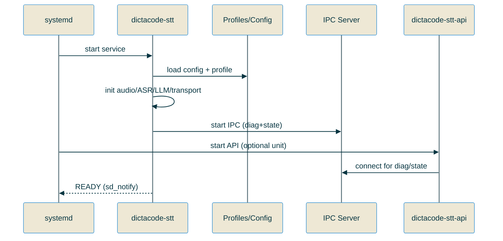

---

## 12. Error Handling (High-Level)

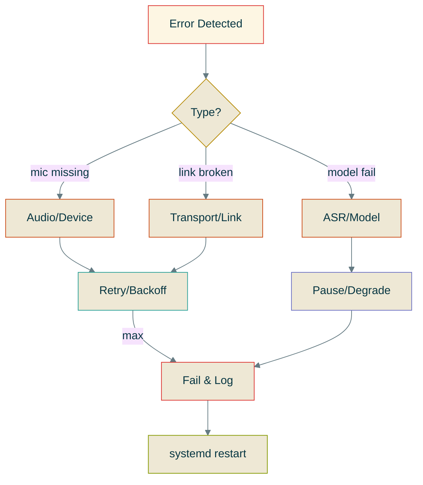

---

## 13. Diagnostics via API (IPC-backed)

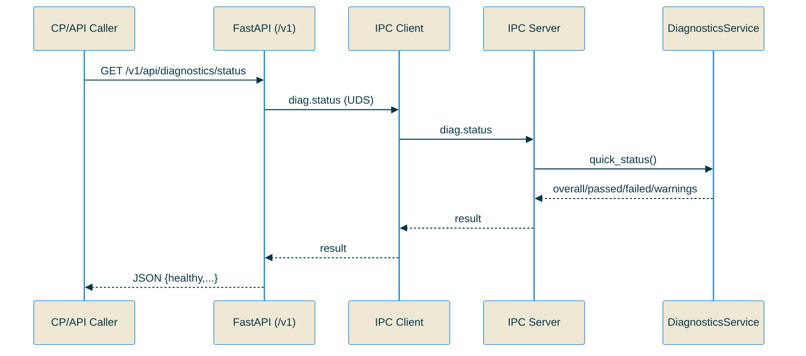

---

## 14. State via CLI (IPC-backed)

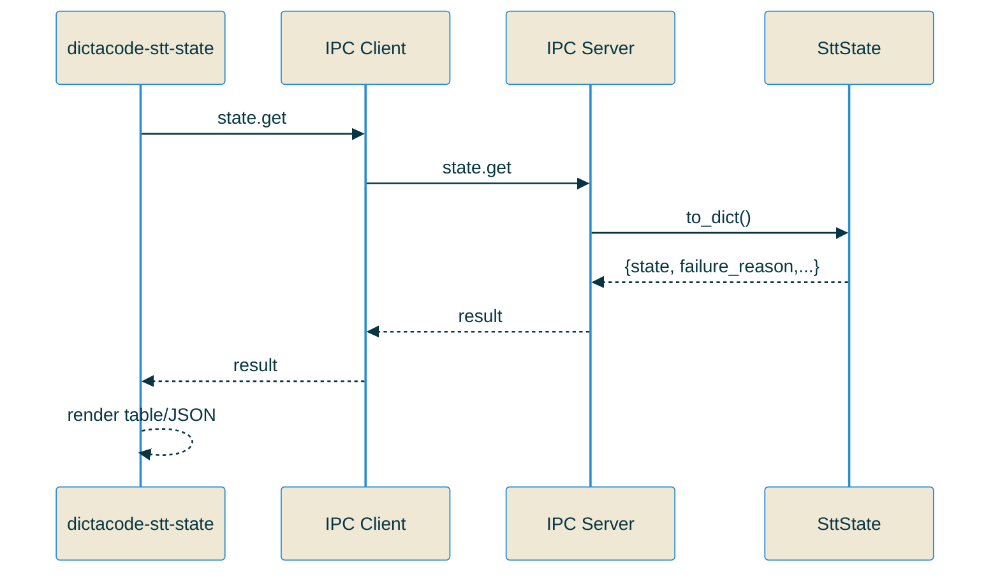

---

## 15. Profile Apply Flow

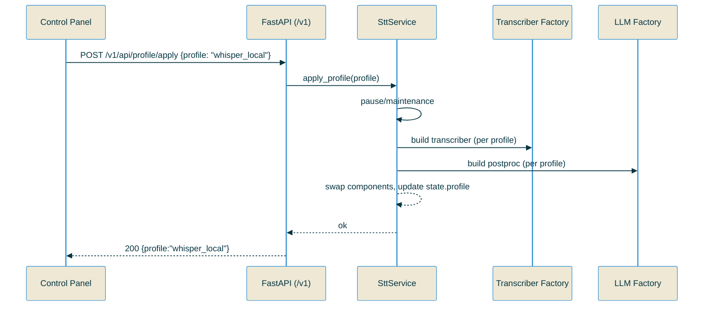

---

## 16. Metrics Scrape (State)

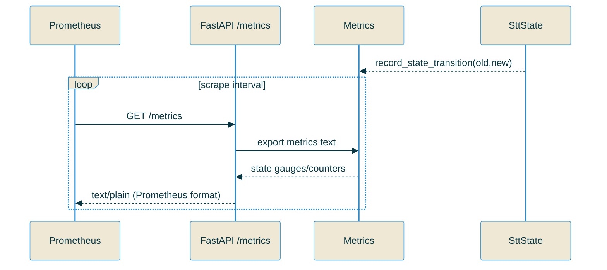

---

## 17. IPC Error Handling

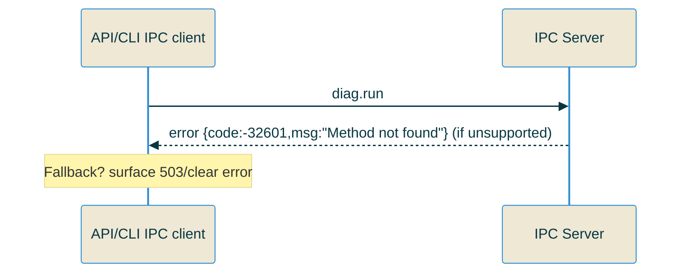

---

## 18. CP Page Load

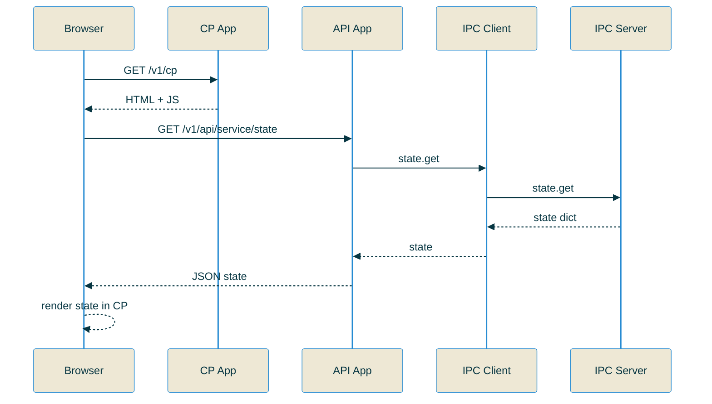
