# dictacode Architecture Diagrams

Solarized Light palette:
- Background: `#fdf6e3` (base3), `#eee8d5` (base2)
- Text: `#657b83` (base00), `#073642` (base02)
- Accents: `#268bd2` (blue), `#2aa198` (cyan), `#859900` (green), `#b58900` (yellow), `#cb4b16` (orange), `#dc322f` (red), `#d33682` (magenta), `#6c71c4` (violet)

---

## 1. System Overview

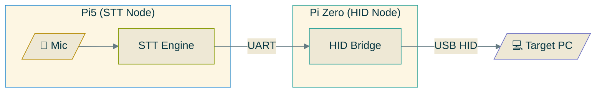

---

## 2. Audio Pipeline

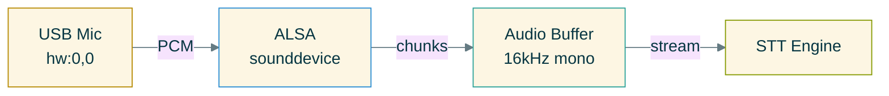

---

## 3. STT Engine Adapters

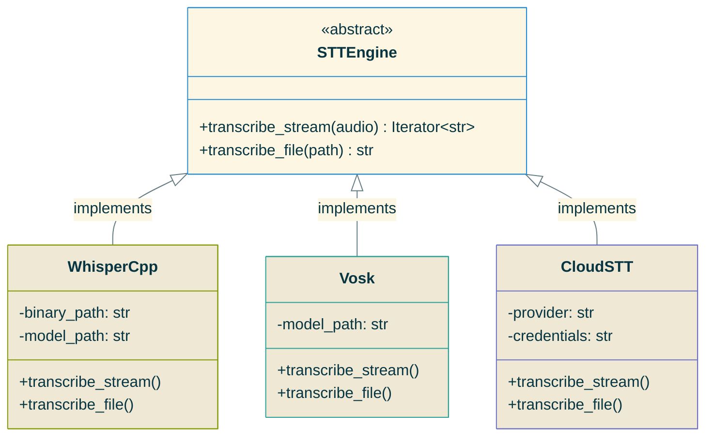

---

## 4. Transport Adapters

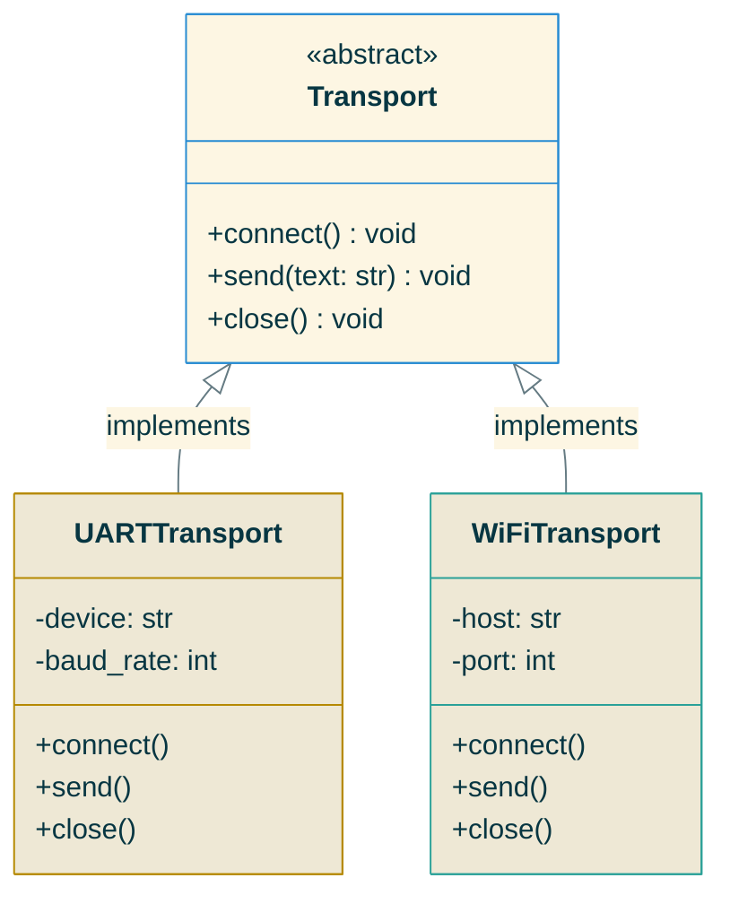

---

## 5. CLI Command Structure

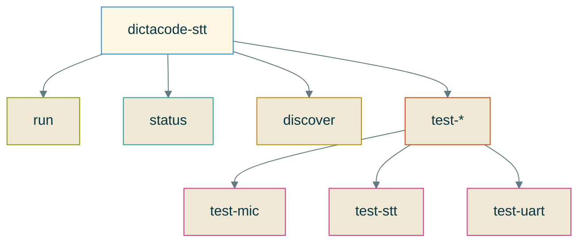

---

## 6. Configuration Loading

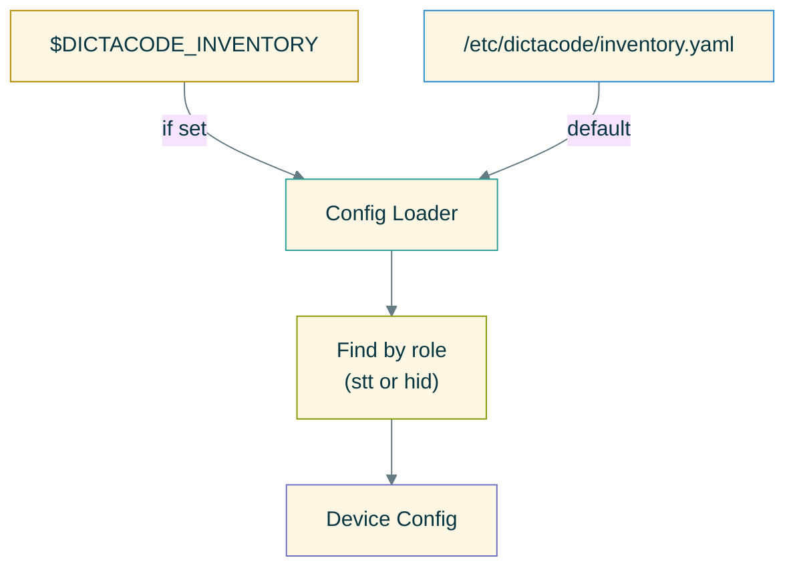

---

## 7. Message Flow (Sequence)

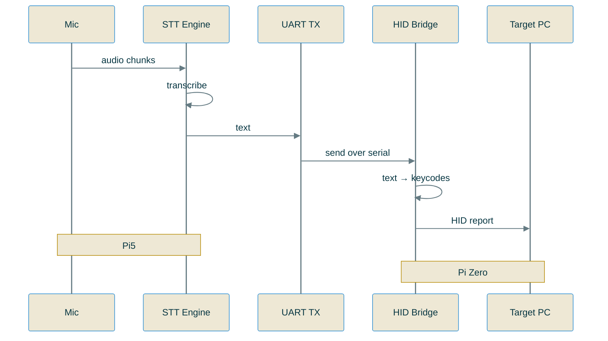

---

## 8. Boot Sequence

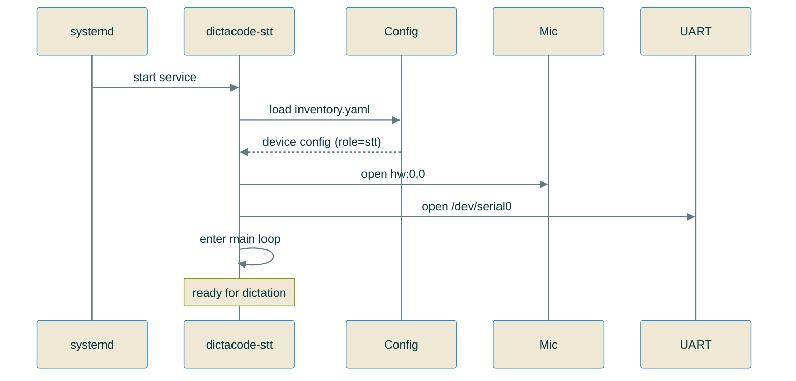

---

## 9. Error Handling

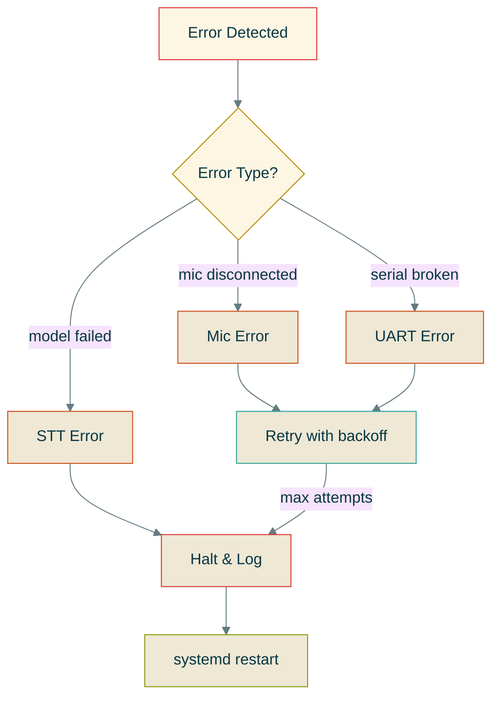

---

## 10. Web Panel Architecture (Future)

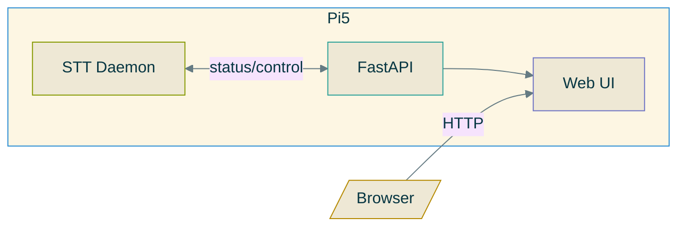

---

## 11. Deployment Flow

```mermaid
%%{init: {'theme': 'base', 'themeVariables': { 'primaryColor': '#fdf6e3', 'primaryTextColor': '#073642', 'primaryBorderColor': '#268bd2', 'lineColor': '#657b83'}}}%%
flowchart LR
    REPO["Git Repo"]
    BUILD["build-deb.sh"]
    DEB["dictacode-bootstrap.deb"]
    SCP["scp to device"]
    DPKG["dpkg -i"]
    INSTALLED["Installed"]

    REPO --> BUILD
    BUILD --> DEB
    DEB --> SCP
    SCP --> DPKG
    DPKG --> INSTALLED

    style REPO fill:#fdf6e3,stroke:#268bd2,color:#073642
    style BUILD fill:#fdf6e3,stroke:#859900,color:#073642
    style DEB fill:#fdf6e3,stroke:#2aa198,color:#073642
    style SCP fill:#fdf6e3,stroke:#b58900,color:#073642
    style DPKG fill:#fdf6e3,stroke:#cb4b16,color:#073642
    style INSTALLED fill:#fdf6e3,stroke:#859900,color:#073642
```

---

## 12. Directory Structure

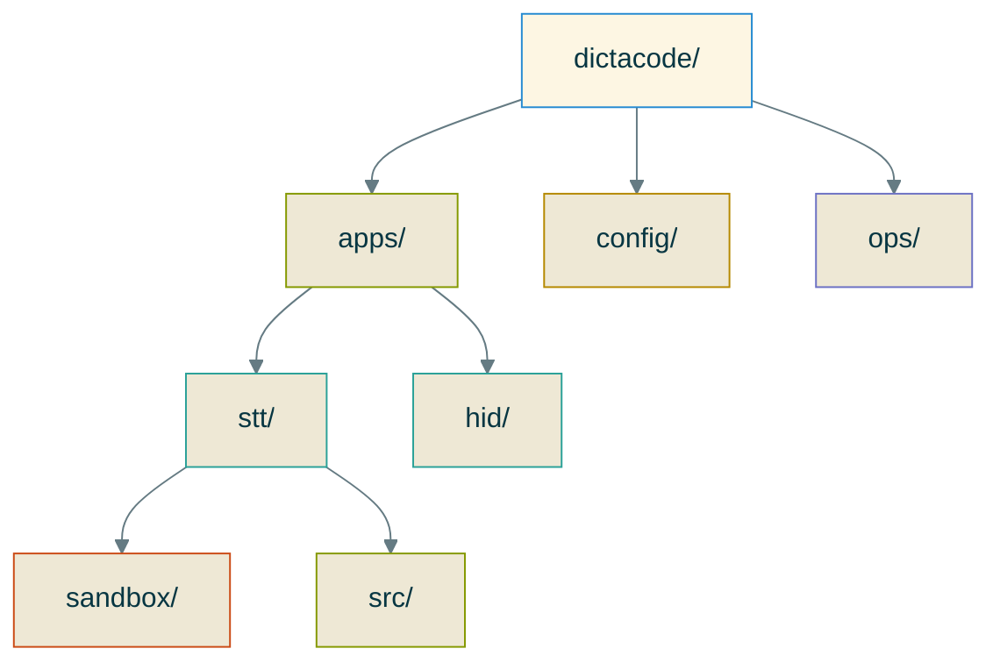
