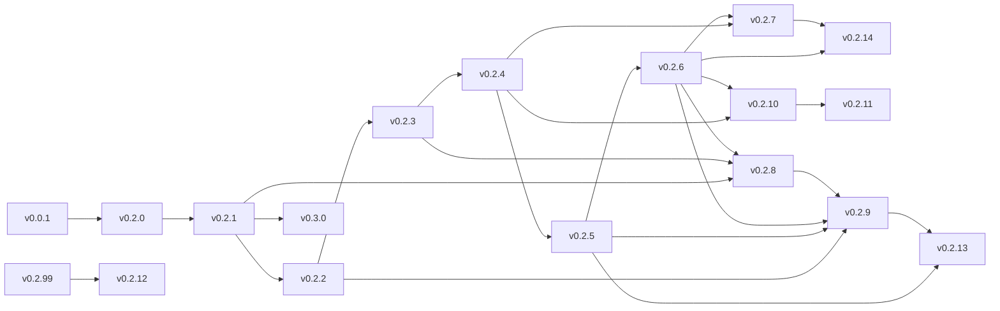

# dictacode Roadmap

## Overview

dictacode is a voice-to-keyboard system that converts speech into keystrokes on a target PC. The system uses a dual-Raspberry Pi architecture: a Pi5 performs speech-to-text transcription while a Pi Zero 2W acts as a USB HID gadget, typing the transcribed text. The critical constraint is sequential character delivery - characters must arrive in exact order with no reordering or silent drops.

The architecture prioritizes reliability over features: better to halt than type wrong text.

---

## Implemented

### v0.0.1 - Target Architecture
**Status: COMPLETE**

Validated the core voice-to-keyboard pipeline through sandbox experiments.

- Voice-to-keyboard pipeline: Mic → Pi5 STT → UART → Pi0 HID → PC
- UART communication at 115200 baud on /dev/serial0
- Protocol design: JSON newline-delimited, msgpack length-prefixed
- CLI entry points: `dictacode-stt`, `dictacode-hid`
- HID keymap support: en_us, de_de

### v0.2.0 - 5-Layer Architecture
**Status: COMPLETE**

Established the layered architecture for both STT and HID apps.

```
Layer 5: Supervisor    - Link health, reconnection, watchdog
Layer 4: Service       - State, commands, handlers, business logic
Layer 3: Protocol      - Message encoding/decoding (JSON, msgpack)
Layer 2: Transport     - Raw byte I/O (UART, HID writes)
Layer 1: Driver (OS)   - /dev/serial0, /dev/hidg0
```

- `UartTransport` and `HidTransport` classes
- `SttService` and `HidService` with state management
- systemd integration with signal handling
- Serial port locking

### v0.2.1 - Supervisor Layer
**Status: COMPLETE**

Added reliability and fault tolerance to UART communication.

- `LinkSupervisor` class for health monitoring
- Timeout detection (30s no activity triggers unhealthy state)
- Reconnection with exponential backoff (1s → 2s → 4s → ... → 30s max)
- systemd watchdog integration (`WATCHDOG=1` notifications)
- `should_send_ping()` method for heartbeat support

### v0.2.2 - Diagnostics Integration
**Status: COMPLETE**

Production-ready diagnostic tools integrated with MAINTENANCE mode.

- `diagnostics/` package with CheckStatus, CheckResult, DiagnosticResult types
- CLI entry points: `dictacode-hid-check`, `dictacode-hid-diagnose`, `dictacode-stt-check`, `dictacode-stt-diagnose`
- Hardware checks: boot config, kernel modules, HID device, audio devices, Whisper binary/model
- Exit codes: 0=OK, 1=FAIL, 2=WARN
- `--json` and `--quiet` output options
- Runtime `diagnose` command via protocol (MAINTENANCE mode only)

---

## Planned

### v0.2.3 - Expanded Solution State
**Status: NOT STARTED** | Prerequisites: v0.2.2

Unified solution state covering the full lifecycle from package install to operation.

- `SolutionState` enum: UNCONFIGURED → LINK_PENDING → HANDSHAKE_INIT → LISTENING
- State behavior predicates: `should_transcribe()`, `should_poll_prerequisites()`
- Supervisor detection methods: `check_prerequisites()`, `check_link_available()`
- Probe/ProbeAck handshake protocol for peer validation
- Service always starts via systemd; state machine handles lifecycle
- `sd_notify STATUS=state={state}` reporting

### v0.2.4 - Audio Port Abstraction
**Status: NOT STARTED** | Prerequisites: v0.2.3

Driver-like abstraction for audio hardware with ring buffer for word cutoff fix.

- `AudioPort` with streaming API: `start_stream()`, `stop_stream()`, callbacks
- `AudioPortManager` for device enumeration and selection
- Stable port IDs: device serial/name → USB path → ALSA fallback
- `AudioRingBuffer` with overlap to prevent word cutoff at recording boundaries
- `Resampler` class for native rate → 16kHz conversion
- Device configuration files in `/etc/dictacode/audio/devices.d/`
- CLI: `dictacode-stt-audio ports`, `--port PORT_ID` flag

### v0.2.5 - Backend/CLI/API Separation
**Status: NOT STARTED** | Prerequisites: v0.2.4

Clean separation for future web panel support.

- Audit CLI for business logic leakage to service layer
- `responses.py` with shared response types: `StatusResponse`, `TranscriptionResult`
- `api.py` scaffold with stub endpoints
- CLI formats as human text; API formats as JSON
- No code duplication between CLI and API

### v0.2.6 - Transcription Adapter Pattern
**Status: NOT STARTED** | Prerequisites: v0.2.5

Adapter pattern enabling multiple transcription engines.

- `TranscriptionAdapter` ABC with `transcribe()`, `is_available()`, `get_audio_requirements()`
- `WhisperAdapter`: whisper.cpp via subprocess
- `VoskAdapter`: Vosk Python library (supports streaming)
- `OnlineAdapter`: stub for Google, Azure, Deepgram
- Factory function: `get_transcriber(name)`
- CLI: `--transcriber whisper|vosk|google`

### v0.2.7 - Streaming Transcription
**Status: NOT STARTED** | Prerequisites: v0.2.4, v0.2.6

Real-time partial results during speech.

- `StreamingTranscriptionAdapter` protocol with `start_streaming()`, `feed_audio()`, `stop_streaming()`
- `PartialResult` and `FinalResult` types with callbacks
- VoskAdapter: native streaming support
- WhisperAdapter: chunked batch fallback (pseudo-streaming)
- Ring buffer feeds streaming adapter continuously
- CLI: `--streaming` flag

### v0.2.8 - Transport Adapter & Multi-HID
**Status: NOT STARTED** | Prerequisites: v0.2.1, v0.2.3, v0.2.6

Multiple transport types and HID device registry.

- `TransportAdapter` ABC with `connect()`, `send()`, `receive()`
- `UartTransport`: refactored existing UART logic
- `UsbSerialTransport`: USB TTL cables (FTDI FT4232H, CH340, etc.)
- `WifiTransport`: TCP socket with mDNS discovery
- `HidDeviceRegistry`: multiple configured devices, one active
- Device configs in `/etc/dictacode/hid/devices.d/`
- CLI: `--transport uart|usb-serial|wifi`, `--hid-device pi0-desk`

### v0.2.9 - Unified Diagnostics & Bug Reports
**Status: NOT STARTED** | Prerequisites: v0.2.2, v0.2.5, v0.2.6, v0.2.8

Comprehensive diagnostics backend with bug report generation.

- `DiagnosticCheck` ABC with categories: system, audio, transcription, transport, config
- `DiagnosticRegistry` with dependency resolution and async execution
- `BugReportGenerator`: collects system info, logs, config, diagnostic results
- Automatic redaction of sensitive data (API keys, passwords)
- Markdown output for GitHub issue submission
- API: `/api/diagnostics/run`, `/api/diagnostics/report`
- CLI: `dictacode-stt-bugreport`

### v0.2.10 - Cross-Platform Audio Backend
**Status: NOT STARTED** | Prerequisites: v0.2.4, v0.2.6

Abstract audio backend for future cross-platform support.

- `AudioBackend` ABC with `list_devices()`, `open_input_stream()`
- `AlsaBackend`: Linux native (wraps current sounddevice code)
- `PortAudioBackend`: cross-platform fallback
- `CoreAudioBackend`: macOS stub
- `WasapiBackend`: Windows stub
- Auto-detection factory: `get_audio_backend()`
- Platform detection for Raspberry Pi, Android

### v0.2.11 - Audio Input Mocking & Testability
**Status: NOT STARTED** | Prerequisites: v0.2.4, v0.2.10

Injectable audio sources for testing without physical microphone.

- `AudioSource` protocol: microphone, file, synthetic
- `MicrophoneSource`: wraps current mic input
- `FileSource`: WAV playback with real-time or fast pacing
- `SyntheticSource`: silence, tone, noise generators
- Test fixtures: `tests/fixtures/audio/speech/hello_world.wav` + expected transcriptions
- `TestHarness` for automated transcription accuracy tests
- CLI: `--audio-source file:path.wav`, `--audio-source synthetic:silence`

### v0.2.12 - Deployment Hygiene & Component Packaging
**Status: NOT STARTED** | Prerequisites: v0.2.99

Structured release process for individual components.

- `components.yaml` manifest documenting releasable components
- `tools/release-pypi.sh`: PyPI releases with version bumping
- `tools/release-deb.sh`: Debian package builds (arm64, armhf)
- `tools/release-tag.sh`: component-specific git tags (`stt/v0.2.12`)
- `tools/release.sh`: interactive release orchestration
- GitHub Actions workflow triggered by tags

### v0.2.13 - Logging & Observability
**Status: NOT STARTED** | Prerequisites: v0.2.5, v0.2.9

Structured logging with runtime control and optional metrics.

- Consistent log format: simple, JSON, systemd modes
- Runtime log level control via CLI, API, and SIGUSR1 signal
- Temporary debug mode with auto-revert after timeout
- Optional Prometheus metrics: transcriptions, latency, HID commands
- Health endpoints: `/health`, `/ready`, `/status`
- Grafana dashboard JSON and alerting rules
- CLI: `--log-level DEBUG`, `--metrics`, `dictacode-stt-log debug`

### v0.2.14 - LLM Post-Processing & Command Detection
**Status: NOT STARTED** | Prerequisites: v0.2.6, v0.2.7

LLM-based text cleanup and voice command preparation.

- `LlmAdapter` ABC with async `complete()` method
- `OllamaAdapter`: local Llama via Ollama
- `OpenAiAdapter`: OpenAI API (gpt-4o-mini)
- `OpenRouterAdapter`: multi-provider access
- Processing profiles: grammar, punctuation, formal, casual, code
- Custom profiles in `/etc/dictacode/profiles/*.yaml`
- `CommandDetector` stub: wake words ("hey dictacode"), action commands
- Graceful fallback to raw text on LLM error
- CLI: `--llm ollama`, `--profile formal`, `--no-llm`

### v0.2.99 - Python Best Practices & Tooling
**Status: NOT STARTED** | Infrastructure (parallel work)

Code quality tooling and CI enforcement.

- `ruff.toml`: linting rules (pycodestyle, pyflakes, isort, bugbear)
- Black configuration in pyproject.toml (line-length 88)
- mypy configuration with gradual typing
- `.pre-commit-config.yaml`: ruff, black, mypy hooks
- `.github/workflows/ci-py.yml`: lint/format/typecheck on PRs
- Makefile: `make lint`, `make format`, `make test`
- VS Code settings and recommended extensions

### v0.3.0 - Web Panel & Bidirectional Protocol
**Status: NOT STARTED** | Prerequisites: v0.2.1+

Browser-based control interface and HID acknowledgments.

- HTTP REST API: `/api/status`, `/api/keymap`, `/api/pause`, `/api/resume`
- WebSocket `/api/ws` for live transcription updates
- Static web panel: status display, keymap selector, pause/resume, live preview
- `ResponseMessage` for HID → STT acknowledgments
- Request ID tracking for command confirmation
- Optional streaming transcription display (partial results)

---

## Version Dependencies


